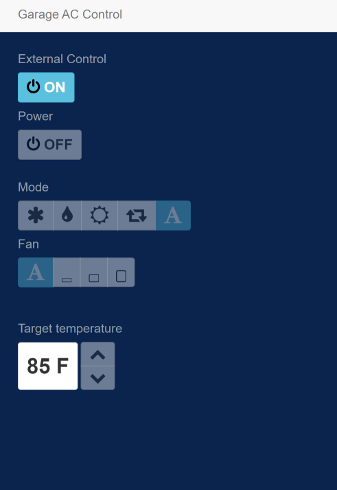

# ESP8266 AC Control with Venstar Thermostat

This is just a modified version of <a href="https://github.com/mariusmotea/esp8266-AC-control.git">Marius Motea's ESP8266 AC Control</a> combined with elements from <a href="https://github.com/mdhiggins/ESP8266-HTTP-IR-Blaster.git">MDHiggins IR Blaster</a> such as MDNS, serial output, and LED ticker.

I have change communication from HTTP to websockets with <a href="https://github.com/Links2004/arduinoWebSockets">arduinoWebSockets</a> and <a href="https://github.com/zimv/websocket-heartbeat-js">Websocket Heartbeat</a>. Just using websockets didn't notify if the server disconnected which was annoying. 

Using a NodeMCU board for this project with IR LED and transistor. 

Once powered on, connect to Wifi SSID ESP Setup (IP 192.168.1.4). Fill out details. Change the GarageAC to whatever IP you want for the NodeMCU device. GarageTstat is the IP of the Venstar thermostat.

## Credits:

AC-Control: https://github.com/mariusmotea/esp8266-AC-control.git 
Websocket Heartbeat: https://github.com/zimv/websocket-heartbeat-js 
Websocket: https://github.com/Links2004/arduinoWebSockets 
IR Blaster: https://github.com/mdhiggins/ESP8266-HTTP-IR-Blaster.git 
Interface: https://github.com/ael-code/daikin-control 
IR library: https://github.com/crankyoldgit/IRremoteESP8266 